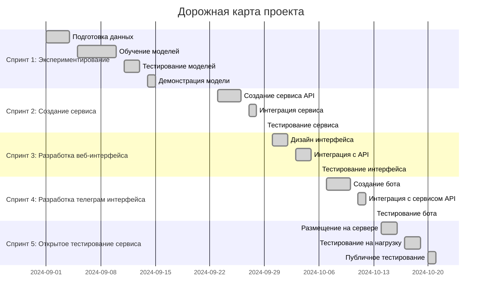

## Дорожная карта

## Спринт 1: Эксперементирование (01.09 -> 15.09)

В рамках данного спринта мы проверяет гипотезу о возможности точного предсказывания цены продажи объекта недвижимости. Сюда входят следующие задачи:

- анализ и подготовка данных
- обучение и тестирование трех моделей
- демонстрация работы модели с помощью веб интерфейса

Цена: 15 000 руб, сроки: 2 недели

## Спринт 2: Создание сервиса (23.09 -> 29.09)

В рамках данного спринта создается сервис REST API, который принимает значения данных по объектам от пользователя и применяет определенную модель.
В качестве ответа сервис возвращает предсказанное моделью значение. Данный сервис можно будет использовать для интеграции на сайт, месседжеры, социальные сети и т.д. Сюда входят следующие задачи:

- Добавление сервиса по поису координат объекта по введенному адресу
- Проверка соответствия матрице сетевых арендаторов
- Сервис будет иметь возможность выбрать одну или более моделей. В случае выбора нескольких моделей сервис возвращает предсказание по каждой модели. Далее данные предсказания можно агрегировать для построение статистик: средние значение, разброс, мин-макс диапозон и т.д.

Цена: 10000 руб, сроки: 1 неделя

## Спринт 3: Разработка веб-интерфейса (30.09 -> 06.10)

В рамках данного спринта создается пользовательский интерфейс для сервиса, созданного на спринте 2. Интерфейс размещается на веб странице и имеет следующие поля:

| Название поля                | Тип данных        | Пример                    | Значение по-умолчанию          |
|------------------------------|-------------------|---------------------------|--------------------------------|
| Метро                        | Категория         | Белорусская               | -                              |
| Округ                        | Категория         | Центральный               | -                              |
| Город                        | Категория         | Москва                    | Москва                              |
| Категория объявления         | Категория         | Жилая недвижимость        | -                              |
| Состояние                    | Категория         | Новостройка               | -                              |
| Общая площадь (м²)           | С точкой          | 50.0                      | 30.0                           |
| Этаж                         | Целочисленное     | 5                         | 2                              |
| Этажность дома               | Целочисленное     | 10                        | 5                              |
| Время до станции (минуты)    | Целочисленное     | 10                        | 5                              |
| До станции                   | Категория         | пешком                    | пешком                         |
| Улица                        | Текст             | Тверская                  | -                              |
| Дом                          | Целочисленное     | 15                        | -                              |
| Корпус                       | Целочисленное     | 2                         | -                              |
| Строение                     | Целочисленное     | 1                         | -                              |
| Квартира                     | Целочисленное     | 35                        | -                              |
| Почтовый индекс              | Целочисленное     | 125009                    | -                              |

- В качестве макета используется [демо-версия](https://github.com/worker-one/real_estate_modeling/blob/main/maket.png) с минимальными изменениями.
- Простая проверка корректности введенных данных (неотрицательные этажи)

Цена: 10000 руб, сроки: 1 неделя.

## Спринт 4: Разработка телеграм интерфейса (07.10 -> 13.10)

В рамках данного спринта создается интерфейс к сервису из спринта 2 через телеграм бот.

- уточнить

## Спринт 5: Открытое тестирование сервиса

В данном спринте сервис с графическим интерфейсом размещяется на продашкн сервере и открывается на публичное тестирование. Сюда входят следующие задачи:

- размещение сервиса на сервере
- тестирование сервиса на нагрузку и исключительные ситуации (например, некорректный ввод данных)

## Опциональные работы

1. Разработка и подключение сервиса для получения дополнительной картографической информации по объекту.
Сроки: 1 неделя
Стоимость: 10 000 руб

В рамках данной работы создается сервис, который позволяет выполнять геоаналитику получать доп. информацию по расположению объекту (наличие метро, магазинов и т.д.)

2. Проверка правильности написание текстовых данных, предложение правильных вариантов написания (название улицы)

Сроки: 0.5 неделя
Стоимость: 5 000 руб

3. Показ пользователю введенного объекта на карте для валидации найденных координат.

Сроки: 0.5 неделя
Стоимость: 4 000 руб

4. Разработка и подключение сервиса для аналитики текста

Сроки: 1 неделя
Стоимость: 10 000 руб
Здесь создается инструмент, который позволяет учитывать текстовое описание объекта при моделировании.

5. Разработка и подключение сервиса для аналитики изображения

Сроки: 1 неделя
Стоимость: 10 000 руб
Здесь создается инструмент, который позволяет учитывать характеристика объекты в виде изображений (план, фотографии фасада, интерьера т.д.)
